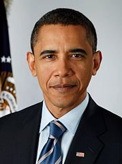
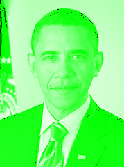

Tancolor
========

A jQuery plugin that processes image using filter algorithm. It currently
processes image into grayscale, bluescale, greenscale, redscale and more to 
come.

Tancolor does not limit it's user to the standard feature, it offers flexibilty
to create our own set of color, let it be "red orange", "purple blue", "cyan"
and so on. Just let your imagination runs wild. The [demo](http://nicolaisi.github.io/tancolor/)
 page shows examples on these. 

Example
=======

The example is provided in the example folder. An interactive [demo](http://nicolaisi.github.io/tancolor/) is
also available.

Dependencies
============

*  [jQuery](https://github.com/jquery/jquery)
*  [Canvas](http://caniuse.com/#feat=canvas)

Install
=======

Download the repository and point to the jquery plugin:

    
    
or

    
    

Usage
=====

By default, this plugin converts image into grayscale. The most simple usecase
is as follow:

    $("#myImageID").tancolor();
    
This results in:

It also offers red, green and blue filter.

Red
---

    $("#myImageID").tancolor({
        mode: "red"
    });
    

Green
-----

    $("#myImageID").tancolor({
        mode: "green"
    });
    

Blue
----

    $("#myImageID").tancolor({
        mode: "blue"
    });
    

Of course you can change every specific parameter to suit your need, there are many grayscale parameters that suits a different application. If the default mode does not suit your need. Feel free to put in your own parameter

    $("#myImageID").tancolor({
        r_weight: 0.34,
        g_weight: 0.5,
        b_weight: 0.16,
        r_intensity: 1,
        g_intensity: 1,
        b_intensity: 1
    });
    
The `*_weight` parameter tune the brightness of the color element. The `*_intensity` parameter determines the color of the image.

You can revert to the original image by providing the source of the image.

    $("#myImageID").tancolor({
        load: 'images/obama.jpg'
    });

Look at the example folder for some code examples.

Motivation
==========

Sometimes during web development, we only need some small tweak on the existing image to tryout color combination. Switching between image processing software such as GIMP or Photoshop can consume a fair amount of time. This plugin provides a quick image processing to achive that. Hopefully, in the future, it will become mature that can help programmer to save time.

